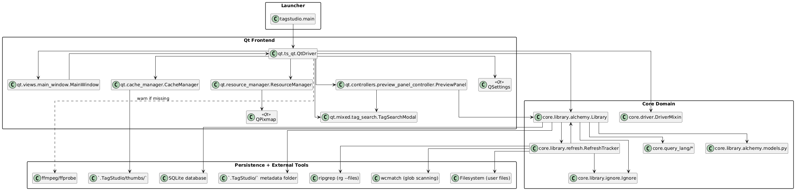
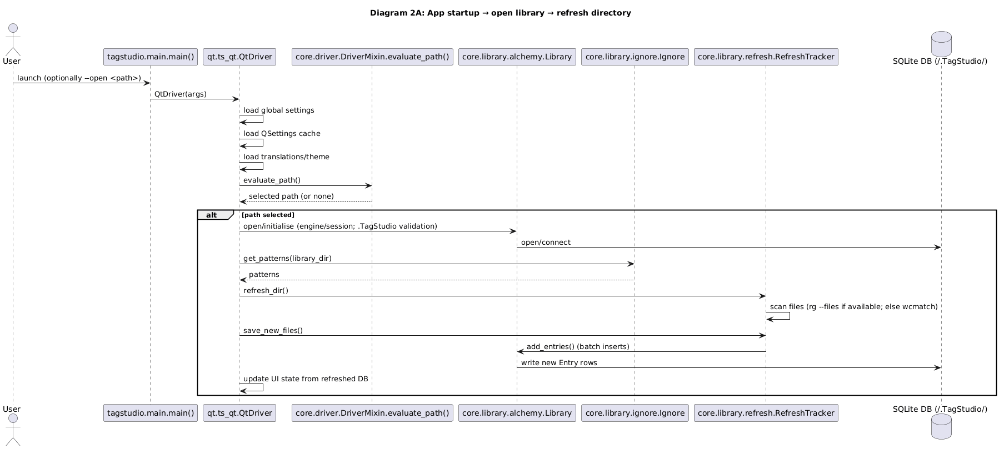
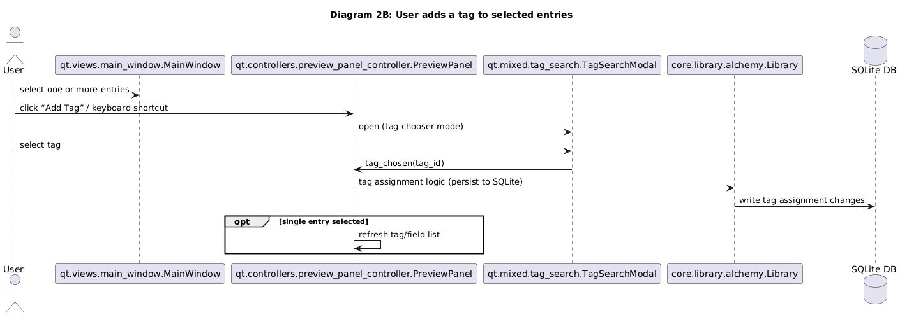

# TagStudioSEF — Architecture Overview and System Purpose

This document provides an overview of the purpose and architecture of TagStudioSEF.

---

## 1. Purpose of the System

TagStudio is a cross-platform desktop application for organising photos and arbitrary files using a tag and custom field metadata model. 
It allows users to open any directory as a *library* without restructuring the underlying filesystem.

When a directory is opened as a library:

- A hidden `/.TagStudio/` folder is created inside that directory.
- All metadata is stored locally in this folder, primarily in a SQLite database.
- The original files remain in place unless explicitly modified by user action.

The key design objectives are:

- Non-destructive file management.
- Portable library format contained within the selected directory.
- Expressive tagging with aliases, parent relationships, and category semantics.
- Efficient scanning and refresh of large directories.
- Clear separation between UI and metadata persistence logic.

---

## 2. Architectural Overview

TagStudioSEF follows a layered architecture:

1. Launcher / Entrypoint
2. Qt Frontend (UI layer)
3. Core Domain (library and metadata logic)
4. Persistence and External Tools

Dependencies flow strictly from top to bottom: the UI depends on the core, and the core depends on persistence and the filesystem.

---

## 3. Structural Component Diagram

The following diagram presents the main components and their relationships.

### 3.1 Launcher

- `tagstudio.main`
- Parses CLI arguments such as `--open`, `--settings-file`, `--cache-file`, `--debug`.
- Instantiates `QtDriver` and starts the application.

### 3.2 Qt Frontend

Main elements:

- `QtDriver`  
  Coordinates application lifecycle, settings, session state, and high-level flows.

- Views (`qt.views.*`)  
  Define windows, panels, and UI widgets.

- Controllers (`qt.controllers.*`)  
  Connect UI events to domain operations.

- Mixed UI modules (`qt.mixed.*`)  
  Implement reusable UI features such as tag search and management.

- `CacheManager`  
  Handles thumbnail caching under `.TagStudio/thumbs/`.

- `ResourceManager`  
  Loads and caches application resources.

The frontend does not directly manipulate the database. 
All metadata operations are delegated to the `Library` facade in the core layer.

### 3.3 Core Domain

Key components:

- `core.library.alchemy.Library`  
  Central façade for metadata operations:
    - Open and validate libraries.
    - Manage SQLAlchemy engine and sessions.
    - CRUD for entries, tags, fields, and relationships.
    - Search, sorting, and pagination.

- `core.library.refresh.RefreshTracker`  
  Scans the filesystem and synchronises it with the database.

- `core.library.ignore.Ignore`  
  Combines global and per-library ignore rules.

- `core.query_lang.*`  
  Implements the query language used for search.

All database access is encapsulated in this layer.

### 3.4 Persistence and External Tools

- SQLite database inside `/.TagStudio/`.
- Thumbnail cache in `/.TagStudio/thumbs/`.
- Optional `.ts_ignore` file.
- Filesystem for entry discovery.
- External tools:
    - `ripgrep` for fast scanning.
    - `wcmatch` as fallback glob scanner.
    - `ffmpeg` for media support.

---

## 4. Runtime Behaviour

Two representative interaction flows illustrate the system’s dynamic behaviour.

---

## 4.1 Startup → Open Library → Refresh

### Flow Description

1. The user launches the application, optionally with `--open <path>`.
2. `main()` instantiates `QtDriver`.
3. The driver loads global settings, QSettings cache, and translations.
4. The driver evaluates the library path:
    - Prefer CLI argument.
    - Optionally fall back to last opened library.
5. If a valid path is selected:
    - The `Library` façade opens or initialises the library.
    - SQLite connection is established.
6. Ignore patterns are retrieved.
7. `RefreshTracker` scans the directory:
    - Uses `ripgrep` if available.
    - Falls back to `wcmatch` otherwise.
8. Newly discovered files are batch-inserted into the database.
9. The UI updates to reflect the refreshed state.

---

## 4.2 Adding a Tag to Selected Entries

### Flow Description

1. The user selects one or more entries in the main window.
2. The user triggers “Add Tag”.
3. The preview panel controller opens the tag search modal.
4. The user selects a tag.
5. The modal emits `tag_chosen(tag_id)`.
6. The controller invokes tag assignment logic in `Library`.
7. The library persists the tag-entry relationship in SQLite.
8. If a single entry is selected, the preview panel refreshes its tag and field list.

All persistence remains confined to the core domain. 
The UI reacts to state changes but does not manipulate database structures directly.

---

## 5. Architectural Characteristics

- Clear separation between UI and domain logic.
- Encapsulated persistence via a `Library` façade.
- Portable per-directory library model.
- Extensible tagging and query system.
- Performance-aware directory refresh mechanism.

TagStudioSEF therefore combines a Qt-based desktop frontend with a SQLAlchemy-backed domain core, structured around a single façade that isolates persistence, refresh logic, and search semantics from the user interface.